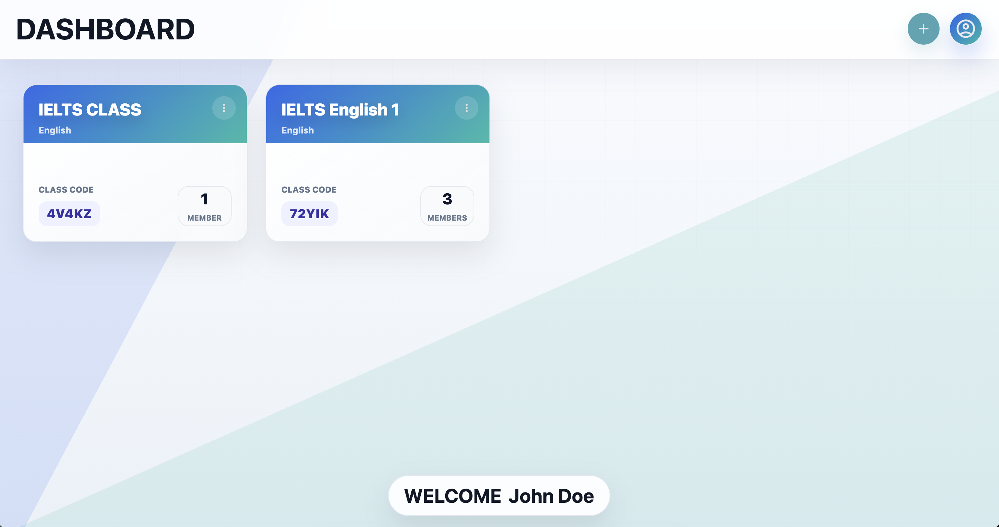
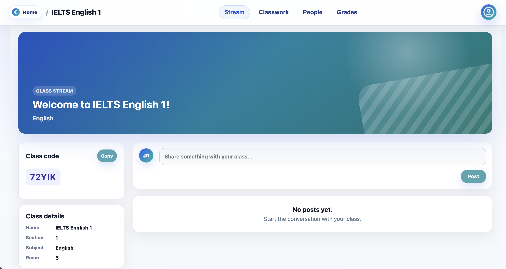
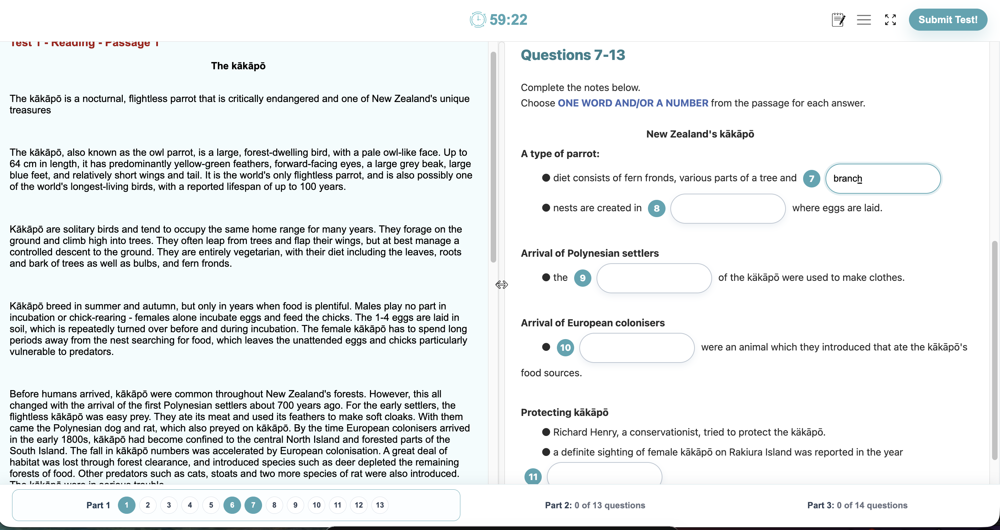

# IELTS Classroom Website

A lightweight IELTS classroom web app built with plain HTML, CSS, JavaScript, Firebase Authentication, and Firestore.

The app supports teacher/student accounts, classroom management, IELTS Reading tests, assignment targeting, grades, score review, class stream posts, comments, folders, and responsive UI.

## Demo

This project is live at [https://vptielts.netlify.app/](https://vptielts.netlify.app/)

Screenshots:







## Features

- Firebase Authentication login and signup.
- Teacher and student classroom roles.
- Create, edit, delete, and join classes.
- Invite students by registered email.
- Kick students from a class.
- Stream page with class announcements and comments.
- Classwork folders with searchable tests.
- Create IELTS Reading tests with 3 parts.
- Per-part passage and question sections.
- Question types:
  - Fill in the blank section.
  - Dropdown matching section.
  - Multiple choice section.
  - Statement selection / per-answer scoring.
- Assign tests to everyone or selected students.
- Student exam page with timer, part navigation, notepad, highlight, and note tools.
- Grades grouped by student for teachers.
- Soft-delete scores by teachers.
- Score page with answer key grouped by part.
- Custom modal popups instead of native browser alerts.

## Project Structure

```text
.
├── index.html
├── netlify.toml
├── css/
│   ├── class.css
│   ├── dashboard.css
│   ├── exam.css
│   ├── score.css
│   └── style.css
├── html/
│   ├── class.html
│   ├── create.html
│   ├── dashboard.html
│   ├── exam.html
│   ├── index.html
│   ├── score.html
│   ├── signup.html
│   └── PNG/
└── js/
    ├── class.js
    ├── dashboard.js
    ├── firebase.js
    ├── firebase-config.example.js
    ├── highlight.js
    ├── notepad.js
    ├── popup.js
    ├── score.js
    ├── test.js
    └── validation.js
```

## Firebase Setup

Create a Firebase project, then enable:

- Authentication with Email/Password.
- Firestore Database.

Copy the example config:

```bash
cp js/firebase-config.example.js js/firebase-config.js
```

Then replace the placeholder values in `js/firebase-config.js` with your Firebase web app config:

```js
export const firebaseConfig = {
    apiKey: "YOUR_FIREBASE_API_KEY",
    authDomain: "YOUR_PROJECT.firebaseapp.com",
    projectId: "YOUR_PROJECT_ID",
    storageBucket: "YOUR_PROJECT.firebasestorage.app",
    messagingSenderId: "YOUR_MESSAGING_SENDER_ID",
    appId: "YOUR_FIREBASE_APP_ID"
};
```

`js/firebase-config.js` is already ignored by Git, so your real API config should not be committed.

## Run Locally

Because the app uses ES modules, run it through a local static server instead of opening files directly.

From the project root:

```bash
python3 -m http.server 8000
```

Then open:

```text
http://localhost:8000
```

## Deploy To Netlify

This project is static. The included `netlify.toml` publishes the project root:

```toml
[build]
  publish = "."
```

On Netlify, deploy the whole project folder. The root `index.html` redirects users to `html/index.html`.

Before deploying, make sure `js/firebase-config.js` exists in the deployed files. If the file is ignored by Git, create it manually in the deploy source or configure your deployment workflow to generate it.

## Notes

- Firebase API keys are not secret in the same way as server keys, but Firestore Security Rules are still important.
- Client-side role checks improve the UI, but production apps should also enforce permissions with Firestore Security Rules.
- New media upload/storage is not part of the current version.
